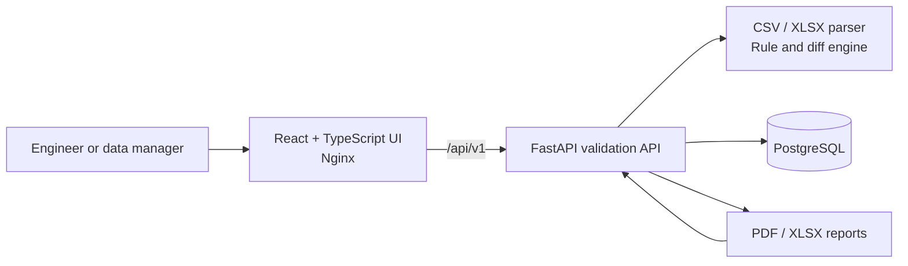

# Electrical Asset Validator

Electrical Asset Validator is a self-hosted web application for validating CSV
and XLSX electrical asset registers and reviewing changes between revisions.
It turns spreadsheet handovers into an explicit, repeatable workflow with
row-level findings, revision diffs, and downloadable reports.

## Problem

Electrical asset registers often move between design, commissioning, and
operations teams as spreadsheets. Small defects—duplicate tags, missing panel
references, invalid ratings, or silent changes between revisions—are difficult
to spot manually and can weaken downstream analysis.

This project provides an auditable data-quality gate. It checks a narrow
tabular contract, explains every finding, and compares revisions by stable
asset tag.
It supports engineering review; it does not certify an electrical design or
replace applicable codes, calculations, or site verification.

## Features

- CSV and XLSX upload with a documented nine-column contract
- required-field, duplicate-tag, format, and numeric-domain checks
- error and warning summaries with row and field context
- before/after comparison with added, removed, and modified assets
- field-level change details keyed by `asset_tag`
- validation history and result retrieval through a versioned API
- PDF and XLSX report downloads for validation runs
- responsive React interface and OpenAPI-backed FastAPI service
- Docker Compose environment with PostgreSQL and health checks
- fictional sample revisions for a reproducible product tour

## Product preview


## Architecture



The production frontend uses same-origin `/api/` requests, which Nginx proxies
to the backend. The backend is the sole source of truth for parsing,
normalization, validation, comparison, and report generation. See
[`docs/architecture.md`](docs/architecture.md) for boundaries, request flows,
and operational decisions.

## Data contract

Inputs may be UTF-8 CSV files or XLSX workbooks. They must include all nine
canonical columns. Header matching normalizes case, surrounding whitespace,
spaces, and hyphens; the following snake-case header is recommended:

```csv
asset_tag,asset_name,asset_type,location,panel_tag,circuit_ref,voltage_v,power_kw,status
```

| Field | Type | Description |
| --- | --- | --- |
| `asset_tag` | string | Required stable identifier, unique within a revision |
| `asset_name` | string | Required human-readable asset name |
| `asset_type` | string | Required organization-defined asset category |
| `location` | string | Required physical or functional location |
| `panel_tag` | string | Upstream panel identifier; required where a parent panel applies |
| `circuit_ref` | string | Circuit or feeder reference; required where a parent circuit applies |
| `voltage_v` | decimal | Required voltage in volts; greater than 0 and at most 1,000,000 |
| `power_kw` | decimal | Required rated power in kilowatts; from 0 to 1,000,000 |
| `status` | string | `active`, `standby`, `maintenance`, or `decommissioned` |

Each upload is limited to 10 MiB by default, 50,000 non-empty data rows,
64 columns, and 32,767 characters per cell. XLSX workbooks also have expanded
archive and compression-ratio safety limits, and their used range may not
extend beyond source row 250,000. A validation retains at most 10,000 finding
details while its metrics and score account for every detected finding; the
final returned finding explains when that bound is reached. Comparisons are
rejected when they would produce more than 10,000 added, removed, or
field-change details. Blank CSV lines are ignored without losing the original
source row numbers reported in findings.

The complete baseline rule catalogue is in
[`docs/rules.md`](docs/rules.md).

## Run with Docker

Prerequisites: Docker Engine with Docker Compose v2.

The development defaults start the complete stack with one command and bind
its published ports to `127.0.0.1`:

```bash
docker compose up --build
```

Open:

- web application: <http://localhost:3000>
- API documentation: <http://localhost:8000/docs>
- health endpoint: <http://localhost:8000/api/v1/health>

To customize ports or credentials:

```bash
cp .env.example .env
docker compose up --build
```

The values in `.env.example` are local-development defaults. Change the
database password and configure `BIND_ADDRESS` deliberately before any shared
or persistent deployment. Stop the stack with `docker compose down`; add
`--volumes` only when you intentionally want to delete the local PostgreSQL
data.

## Local development

### Backend

Python 3.12 or newer is required.

```bash
cd backend
python -m venv .venv
# Activate .venv with the command for your shell.
python -m pip install --upgrade pip
python -m pip install -e ".[dev]"
python -m uvicorn electrical_asset_validator.main:app --reload
```

The backend defaults to a local SQLite database when
`EAV_DATABASE_URL` is not set. Run its tests with:

```bash
cd backend
python -m pytest
```

### Frontend

Node.js 22 or newer is recommended.

```bash
cd frontend
npm ci
npm run dev
```

Vite serves the app at <http://localhost:5173> and proxies `/api` to
`http://localhost:8000` by default. Override the proxy with
`VITE_API_PROXY_TARGET`.

Frontend quality checks:

```bash
cd frontend
npm run lint
npm run test
npm run build
```

## API summary

All application routes are versioned below `/api/v1`.

| Method | Route | Purpose |
| --- | --- | --- |
| `GET` | `/health` | Liveness and dependency status |
| `POST` | `/validations` | Upload and validate one CSV or XLSX file (`file`) |
| `GET` | `/validations` | List validation runs |
| `GET` | `/validations/{id}` | Retrieve one validation result |
| `GET` | `/validations/{id}/report.xlsx` | Download an XLSX validation report |
| `GET` | `/validations/{id}/report.pdf` | Download a PDF validation report |
| `POST` | `/comparisons` | Compare `before_file` and `after_file` uploads |
| `GET` | `/comparisons/{id}` | Retrieve one comparison result |

Interactive request and response schemas are available from `/docs` when
`EAV_DOCS_ENABLED=true`.

## Sample workflow

The files under [`sample-data/`](sample-data/) are fictional. Revisions A and B
form a clean comparison pair; `invalid-register.csv` contains deliberate
data-quality failures.

Validate the deliberately invalid register:

```bash
curl --fail-with-body \
  -F "file=@sample-data/invalid-register.csv;type=text/csv" \
  http://localhost:8000/api/v1/validations
```

Compare the two revisions:

```bash
curl --fail-with-body \
  -F "before_file=@sample-data/revision-a.csv;type=text/csv" \
  -F "after_file=@sample-data/revision-b.csv;type=text/csv" \
  http://localhost:8000/api/v1/comparisons
```

The expected highlights—including a duplicate tag, missing values, invalid
numbers, one removed asset, one added asset, and several field changes—are described in
[`sample-data/README.md`](sample-data/README.md).

## Project structure

```text
.
├── backend/                 FastAPI service, validation engine, and reports
├── frontend/                React and TypeScript web application
├── sample-data/             Fictional demonstration revisions
├── docs/
│   ├── architecture.md      Runtime boundaries and design decisions
│   └── rules.md             Validation and comparison rule catalogue
├── .github/workflows/ci.yml Backend and frontend continuous integration
├── .env.example             Local configuration template
└── docker-compose.yml       Frontend, backend, and PostgreSQL stack
```

## Privacy and security

- This repository does not intentionally add telemetry, analytics, or
  third-party upload services.
- In the self-hosted stack, uploaded register data is processed by the
  configured backend and results may be stored in its database.
- Asset registers can reveal operational infrastructure. Operators must define
  access control, retention, backups, encryption, and incident procedures.
- The local stack does not provide TLS, authentication, or authorization. Put
  it behind an appropriate trusted gateway before exposing it to a network.
  Compose binds published ports to loopback by default.
- Do not use the fictional sample data as an engineering design basis.

## Decisions

- **One tabular contract:** accepting CSV and XLSX without format-specific
  business rules keeps results consistent while fitting common handover tools.
- **Stable identity:** comparisons use `asset_tag`; a tag change is an addition
  plus a removal.
- **Server-owned rules:** validation and reports share one implementation.
- **Bounded synchronous processing:** FastAPI executes upload work in worker
  threads, and explicit compressed-size, expanded-size, row, column, and cell
  limits plus finding and comparison-detail caps keep the request-lifecycle
  MVP predictable.
- **Same-origin frontend:** production API calls avoid environment-specific
  hosts in the browser bundle.

## Current limitations

- Input is limited to CSV and XLSX; legacy XLS and arbitrary workbook layouts
  are not supported.
- There is no configurable column mapping or multi-sheet import workflow.
- Asset types are free text rather than a managed taxonomy.
- Processing stays within the request lifecycle, accepts at most 50,000
  non-empty rows, returns at most 10,000 validation finding details, and
  rejects comparisons above 10,000 details; asynchronous jobs, pagination for
  result details, and object storage are not included.
- There is no authentication, role model, approval workflow, or multi-tenant
  isolation.
- Renamed asset tags are not inferred.
- The baseline rules check data quality, not electrical-code compliance or
  engineering correctness.
- Production TLS, secret management, backups, monitoring, and database
  migration procedures are deployment responsibilities.

## Roadmap

- organization-specific rule packs and controlled taxonomies
- authentication, roles, and immutable review history
- configurable column mapping and richer workbook import workflows
- asynchronous processing with object storage for large registers
- explicit retagging and revision approval workflows
- signed report artifacts and richer trend dashboards
- import/export integrations for asset-management platforms

## License

Released under the [MIT License](LICENSE).
