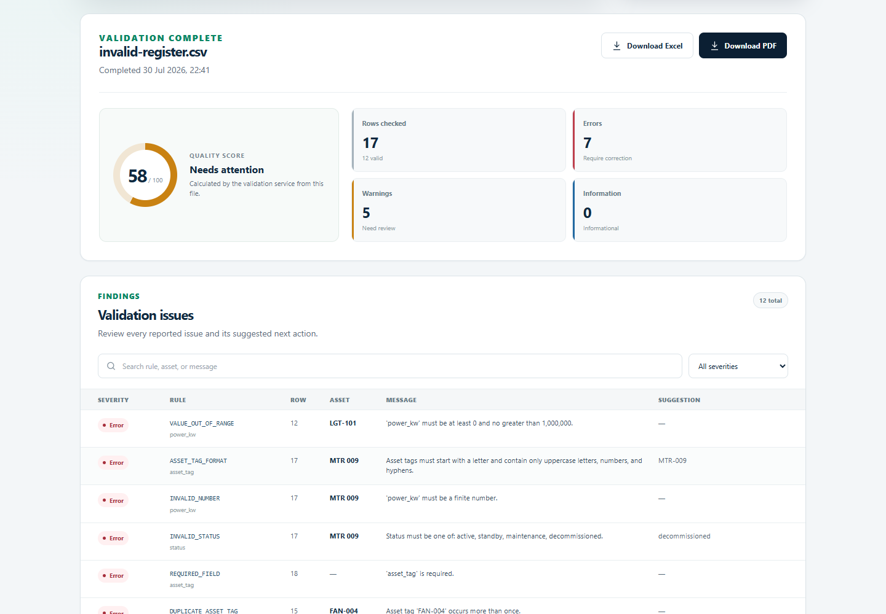
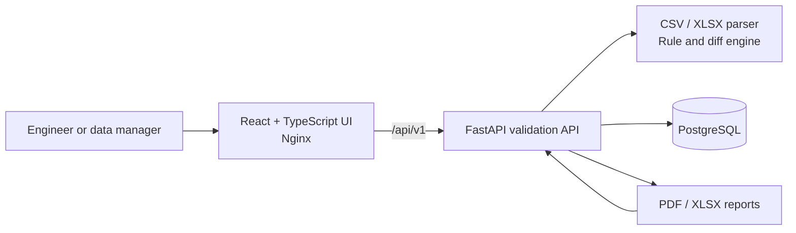

# Electrical Asset Validator

Electrical Asset Validator is a self-hosted web application for validating
CSV and XLSX electrical asset registers. You upload an asset register, it
tells you what's wrong with it, and it can diff two revisions so you see what
changed. Findings are reported per row, and results can be downloaded as PDF
or XLSX reports.

[**Try the live demo**](https://electrical-asset-validator.fly.dev/) - a small
public instance loaded with fictional sample data. Anything you upload is
wiped when it restarts.

## Problem

Electrical asset registers move between design, commissioning, and operations
teams as spreadsheets. Duplicate tags and missing panel references are easy
to miss in a long register. So are invalid ratings. Changes between revisions
are even easier to miss, and bad data weakens any analysis built on top of it.

This project is a data-quality gate for that handover. It checks a narrow
tabular contract and explains every finding. Revisions are compared by stable
asset tag. It supports engineering review. It does not certify an electrical
design, and it does not replace applicable codes, calculations, or site
verification.

## Features

- Upload CSV or XLSX files. Both go through the same documented nine-column
  contract: required fields, duplicate tags, formats, and numeric ranges.
- Errors and warnings come with the row and field they refer to.
- Compare two revisions to get added, removed, and modified assets, plus
  field-level change details keyed by `asset_tag`.
- Past validations stay retrievable through a versioned API.
- Reports download as PDF or XLSX.

The frontend is a responsive React app. The backend is a FastAPI service with
an OpenAPI schema. Docker Compose runs the whole stack with PostgreSQL and
health checks, and fictional sample data is included so you can try it
without a real register.

## Product preview



## Architecture



The production frontend makes same-origin `/api/` requests, which Nginx
proxies to the backend. Parsing, normalization, validation, comparison, and
report generation all happen in the backend. See
[`docs/architecture.md`](docs/architecture.md) for boundaries, request flows,
and operational decisions.

## Data contract

Inputs may be UTF-8 CSV files or XLSX workbooks, and they must include all
nine canonical columns. Header matching normalizes case, surrounding
whitespace, spaces, and hyphens. This snake_case header row is the
recommended form:

```csv
asset_tag,asset_name,asset_type,location,panel_tag,circuit_ref,voltage_v,power_kw,status
```

| Field | Type | Description |
| --- | --- | --- |
| `asset_tag` | string | Required stable identifier, unique within a revision |
| `asset_name` | string | Required human-readable asset name |
| `asset_type` | string | Required organization-defined asset category |
| `location` | string | Required physical or functional location |
| `panel_tag` | string | Upstream panel identifier; required where a parent panel applies |
| `circuit_ref` | string | Circuit or feeder reference; required where a parent circuit applies |
| `voltage_v` | decimal | Required voltage in volts; greater than 0 and at most 1,000,000 |
| `power_kw` | decimal | Required rated power in kilowatts; from 0 to 1,000,000 |
| `status` | string | `active`, `standby`, `maintenance`, or `decommissioned` |

Uploads are limited to 10 MiB by default, 50,000 non-empty data rows,
64 columns, and 32,767 characters per cell. XLSX workbooks get extra safety
limits on expanded archive size and compression ratio, and their used range
may not extend beyond source row 250,000. A validation keeps at most 10,000
finding details. Its metrics and quality score still count every finding, and
the last returned finding says when that cap was reached. Comparisons are
rejected when they would produce more than 10,000 added, removed, or
field-change details. Blank CSV lines are skipped, but findings still report
the original source row numbers.

The complete baseline rule catalogue is in
[`docs/rules.md`](docs/rules.md).

## Run with Docker

Prerequisites: Docker Engine with Docker Compose v2.

The development defaults bind published ports to `127.0.0.1` and start the
whole stack with one command:

```bash
docker compose up --build
```

Open:

- web application: <http://localhost:3000>
- API documentation: <http://localhost:8000/docs>
- health endpoint: <http://localhost:8000/api/v1/health>

These addresses are served by the stack you just started, so they only respond
while `docker compose up` is running.

To customize ports or credentials:

```bash
cp .env.example .env
docker compose up --build
```

The values in `.env.example` are local-development defaults. Change the
database password and configure `BIND_ADDRESS` deliberately before any shared
or persistent deployment. Stop the stack with `docker compose down`; add
`--volumes` only when you intentionally want to delete the local PostgreSQL
data.

## Local development

### Backend

Python 3.12 or newer is required.

```bash
cd backend
python -m venv .venv
# Activate .venv with the command for your shell.
python -m pip install --upgrade pip
python -m pip install -e ".[dev]"
python -m uvicorn electrical_asset_validator.main:app --reload
```

The backend defaults to a local SQLite database when
`EAV_DATABASE_URL` is not set. Run its tests with:

```bash
cd backend
python -m pytest
```

### Frontend

Node.js 22 or newer is recommended.

```bash
cd frontend
npm ci
npm run dev
```

Vite serves the app at <http://localhost:5173> and proxies `/api` to
`http://localhost:8000` by default. Override the proxy with
`VITE_API_PROXY_TARGET`.

Frontend quality checks:

```bash
cd frontend
npm run lint
npm run test
npm run build
```

## API summary

All application routes are versioned below `/api/v1`.

| Method | Route | Purpose |
| --- | --- | --- |
| `GET` | `/health` | Liveness and dependency status |
| `POST` | `/validations` | Upload and validate one CSV or XLSX file (`file`) |
| `GET` | `/validations` | List validation runs |
| `GET` | `/validations/{id}` | Retrieve one validation result |
| `GET` | `/validations/{id}/report.xlsx` | Download an XLSX validation report |
| `GET` | `/validations/{id}/report.pdf` | Download a PDF validation report |
| `POST` | `/comparisons` | Compare `before_file` and `after_file` uploads |
| `GET` | `/comparisons/{id}` | Retrieve one comparison result |

Interactive request and response schemas are available from `/docs` when
`EAV_DOCS_ENABLED=true`.

## Sample workflow

The files under [`sample-data/`](sample-data/) are fictional. Revisions A
and B form a clean comparison pair, and `invalid-register.csv` contains
deliberate data-quality failures.

Validate the deliberately invalid register:

```bash
curl --fail-with-body \
  -F "file=@sample-data/invalid-register.csv;type=text/csv" \
  http://localhost:8000/api/v1/validations
```

Compare the two revisions:

```bash
curl --fail-with-body \
  -F "before_file=@sample-data/revision-a.csv;type=text/csv" \
  -F "after_file=@sample-data/revision-b.csv;type=text/csv" \
  http://localhost:8000/api/v1/comparisons
```

[`sample-data/README.md`](sample-data/README.md) describes what to expect:
a duplicate tag, missing values, invalid numbers, one removed asset, one
added asset, and several field changes.

## Project structure

```text
.
├── backend/                 FastAPI service, validation engine, and reports
├── frontend/                React and TypeScript web application
├── sample-data/             Fictional demonstration revisions
├── docs/
│   ├── architecture.md      Runtime boundaries and design decisions
│   └── rules.md             Validation and comparison rule catalogue
├── .github/workflows/ci.yml Backend and frontend continuous integration
├── .env.example             Local configuration template
└── docker-compose.yml       Frontend, backend, and PostgreSQL stack
```

## Privacy and security

- This repository does not intentionally add telemetry, analytics, or
  third-party upload services.
- In the self-hosted stack, uploaded register data is processed by the
  configured backend, and results may be stored in its database.
- Asset registers can reveal operational infrastructure. Access control,
  retention, backups, encryption, and incident procedures are up to the
  operator.
- The local stack has no TLS, authentication, or authorization. Put it behind
  a trusted gateway before exposing it to a network. Compose binds published
  ports to loopback by default.
- Do not use the fictional sample data as an engineering design basis.

## Decisions

CSV and XLSX go through exactly the same rules. There are no format-specific
business rules, so the same register produces the same results either way,
and both formats fit the tools registers actually get handed over in.

Comparison identity comes from `asset_tag`. If a tag changes, the diff shows
a removal plus an addition. The tool does not try to guess renames.

All rules live server-side. Validation and the generated reports share one
implementation.

Processing is synchronous and deliberately bounded. FastAPI runs upload work
in worker threads, and the explicit caps on compressed size, expanded size,
rows, columns, cells, findings, and comparison details keep a request
predictable for this MVP.

Same-origin frontend, so no environment-specific hostnames end up in the
browser bundle.

## Current limitations

- Input is CSV and XLSX only. Legacy XLS and arbitrary workbook layouts are
  not supported.
- No configurable column mapping, and no multi-sheet import workflow.
- Asset types are free text rather than a managed taxonomy.
- Everything happens inside the request lifecycle: at most 50,000 non-empty
  rows per file, at most 10,000 validation finding details, and comparisons
  are rejected above 10,000 details. There are no asynchronous jobs, no
  pagination for result details, and no object storage.
- No authentication, role model, approval workflow, or multi-tenant
  isolation.
- Renamed asset tags are not inferred.
- The baseline rules check data quality, not electrical-code compliance or
  engineering correctness.
- Production TLS, secret management, backups, monitoring, and database
  migration procedures are the deployment's responsibility, not the app's.

## Roadmap

Things I'd like to add eventually: authentication and roles, and configurable
column mapping so the nine-column format isn't mandatory. Asynchronous
processing for registers too big for the current limits would come after
that. No promises on timing.

## License

Released under the [MIT License](LICENSE).
