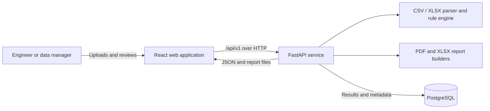
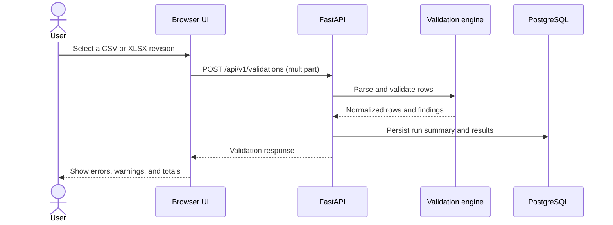

# Architecture

## Context

Electrical Asset Validator is a small self-hosted web application for checking
CSV and XLSX asset registers and comparing controlled revisions. The browser
provides the workflow, the API owns parsing and business rules, and PostgreSQL
stores validation and comparison results.

## Runtime topology

Docker Compose runs three services:

1. `frontend` serves the compiled single-page application through Nginx and
   proxies same-origin `/api/` requests to the backend.
2. `backend` exposes FastAPI on port 8000 inside the Compose network.
3. `postgres` provides persistent relational storage through a named volume.

Frontend port 3000 and backend port 8000 are published on `127.0.0.1` by
default. Direct backend access remains convenient for local API development
without exposing the unauthenticated services to the LAN. Production operators
must place the stack behind a trusted TLS gateway before changing
`BIND_ADDRESS`.

## Request flow

A comparison follows the same boundary but sends `before_file` and
`after_file`. The service verifies the canonical schema and stable identity
requirements before matching rows by `asset_tag` and computing field-level
differences. Run full validation separately when a revision contains blocking
data-quality failures.

## Component boundaries

### Frontend

- React and TypeScript presentation layer
- CSV and XLSX selection and submission
- validation summary, findings table, and comparison review
- report download links
- no client-side source of truth for engineering rules

### Backend

- filename-extension, compressed-size, and expanded-workload checks
- CSV/XLSX decoding, header validation, and row normalization
- deterministic validation and revision comparison
- persistence and report generation
- OpenAPI contract under `/docs` when enabled

### Database

- run metadata and processed results, keyed to an opaque per-session token
- health-gated startup in Docker Compose
- persistent named volume for local deployments

Uploaded files and validation results can contain infrastructure information.
Stored runs are scoped to a random httponly session cookie, so one browser
session cannot list or fetch another's runs or reports; this is isolation,
not authentication. `EAV_DEMO_RETENTION_MINUTES` optionally deletes runs
older than the window, swept lazily on the next API request - the public
demo uses it. Database backups, longer-term retention policy, access
control, and encryption remain deployment responsibilities.

## Key decisions

### Format-neutral tabular contract

CSV is transparent and diffable, while XLSX is common in engineering handovers.
Both formats enter the same narrow column contract and rule engine so results
remain predictable. Configurable column mapping and complex multi-sheet
workflows are deferred.

### Stable tags as identity

`asset_tag` is the only cross-revision key. Names and locations can change,
while identity should not. A future alias workflow may model retagging
explicitly.

### Server-owned rules

Rules run only in the backend so browser behavior cannot diverge from API
results or generated reports. Rule identifiers are stable integration points.

### Synchronous MVP

Uploads are processed within the request lifecycle, with synchronous endpoints
run by FastAPI in worker threads so pandas, report building, and SQLAlchemy do
not block the event loop. A pre-parse ASGI byte counter bounds multipart
spooling, including chunked uploads. The default 10 MiB per-file limit is
reinforced by row, column, source-row-extent, cell-length, expanded-XLSX,
archive-entry, and compression-ratio limits. Returned validation finding
details and accepted comparison details are capped at 10,000; validation
metrics continue to reflect every detected finding. A job queue and object
storage are roadmap items for larger registers.

### Same-origin production API

Nginx proxies `/api/` to the backend. This avoids embedding environment-specific
backend hosts in the compiled frontend and reduces cross-origin configuration.

## Operational notes

- Health checks gate backend startup on PostgreSQL and frontend startup on the
  backend.
- Continuous integration builds both images and smoke-tests the complete
  PostgreSQL-backed stack.
- Configuration is supplied through environment variables; secrets are not
  committed.
- Compose credentials are development defaults and must be changed outside a
  local workstation.
- The application does not configure TLS, authentication, backups, or log
  aggregation.
- Schema migration and backup procedures should be established before a
  production deployment.

## Extension points

The contract can evolve through versioned API schemas and additive tabular
fields.
Likely extensions include organization-specific rule packs, controlled
taxonomies, authentication and roles, asynchronous processing, signed reports,
and integration with document or asset-management systems.
